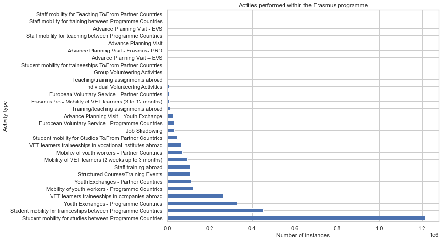

## MILESTONE 1

### 1. Dataset
The dataset we are using is [Erasmus mobility statistics](https://data.europa.eu/data/datasets/erasmus-mobility-statistics-2014-2019-v2?locale=en) collected for the years 2014 to 2019, found on [Data Europa](https://data.europa.eu/en)’s website and created by the Directorate-General for Education, Youth, Sport, and Culture. It contains information on the mobility of both students and teachers, with more than 3 million participants. Each mobility activity is characterized by 24 attributes that show its mobility period data, personal information, and sending and receiving organizations for its program. The practical information on mobility period includes the academic year, start and end months, duration, and the mobility type. Also, there is personal information about each participant, such as gender, age, nationality, the field of education, education level, whether a participant is a learner or staff, if it requires special needs, etc. For sending and receiving organizations participating in the program, we have their codes, city, and names. 

The whole data set is divided into six CSV files, where each file consists of mobility program information for a specific year. In addition to those files, there is an Excel sheet with a brief summary of the data. The data set is not completely clean and requires some preprocessing. Since the data contained within the dataset is quite large, we further explore it and focus on certain subsets to better visualize and derive the most relevant information.

### 2. Problematic
The Erasmus mobility program (EuRopean Community Action Scheme for the Mobility of University Students) is a program that provides free movement and education between students and universities or institutions. Today, it stands as one of the largest international student exchange programs globally, with more than 3.3 million students since its founding in 1987. For students and staff as participants in the program, it brings many benefits, such as learning, exploring different cultures, forming international connections, language skills, traveling, and personal development. Its significance also reaches institutions participating in exchange programs. It creates a more open and accessible environment, modifying institutions' courses and teaching methods to attract international students and become more modernized. Hence, our project can bring more insight and value to both types of participants in the program.

The aim of the project is to visualize and provide insights into the structure of educational mobility in Europe. Some of the key viewpoints we would like to include in our visualization include:
* **Institutional and geographic aspect of mobility:** explore the volume of sent/received students per country/institution, highlight countries/institutions with a disproportion between sent/received participants, and identify strong ties between certain countries/institutions.
* **Temporal aspect of mobility**: explore and present how the trends in mobility change with time.
* **Demographic aspect of mobility**: understand the differences in the structure of mobilities for different demographic groups, show the impact of attributes such as age, gender, education level, or nationality on the activity in the mobility program.

We want our end product to offer the user an interactive visualization environment that allows them to explore the data on their own.

### 3. Exploratory Data Analysis
The dataset is divided into two parts corresponding to two Key Actions: KA1 and KA3. KA1 is the Erasmus+ Exchange program we’re all familiar with. KA3 on the other hand assists in the creation of new policies at the European Union and system level in the domains of education, youth development, and sport. We will focus on KA1, since our main point of interest are the student exchanges.

The KA1 dataset contains 3.1 million rows, containing different types of activities, such as student exchanges (1.2 m) and traineeships (0.452 m). For activity count distribution see plot below:

  

Before we get started with the analysis, a few preprocessing steps need to be performed, including:
* Parsing missing values: there are multiple representations of a missing value in the dataset, including: “-”, “Undefined” and “?? Unknown”.
* Removing outliers and invalid entries, e.g. negative/very large age.
* Normalizing the values, e.g. some durations are expressed in months, some in days.
* Dealing with duplicate entries, e.g. there are multiple labels for some institutions, e.g. consider EPFL and Ecole Polytechnique Fédérale de Lausanne
* Establishing a strategy of dealing with missing values, since majority of the rows in the dataset contain at least one missing value.

For our EDA we’ve created several reports for our KA1 and KA3 data which spans five consecutive years. A summary of our dataset is as follows:
<table align="center"><thead><tr><th>Name</th><th>Value</th></tr></thead><tbody><tr><td>Rows</td><td>3,462,258</td></tr><tr><td>Complete Rows</td><td>40.2%</td></tr><tr><td>Columns</td><td>24</td></tr><tr><td>Discrete Features</td><td>22</td></tr><tr><td>Continuous Features</td><td>2</td></tr><tr><td>Missing Observations</td><td>6.5%</td></tr><tr><td>Total Observations</td><td>83,094,192</td></tr></tbody></table>

  

Observing the evolution of the total number of participants in the programme across time, we notice a clear increasing trend. Moreover, the number of participants in the academic year 2014/15 seems very low compared to others, which might suggest that the data for that year is incomplete.

  

While the majority of participants, including high-school and university students, are classified as “Learners”, there is still a fair number of activities involving staff (e.g. teacher training).

  

We also notice that there are significantly more female than male participants - around a 60-40 split.

  

The age distribution of participants shows a visible peak in the 18-25 which corresponds to a typical age of university students. However, there are still quite a lot of participants in the age bracket 30-60, possibly PHD/Postdoc students and academic staff.

The number of distinct values for each column is presented below: 
Field of Education: 168 categories 
Participant Nationality: 227 categories 
Participant Age: 342 categories 
Sending Country Code: 163 categories 
Sending City: 36351 categories 
Sending Organization: 66197 categories 
Sending Organisation Erasmus Code: 5187 categories 
Receiving Country Code: 159 categories 
Receiving City: 79432 categories 
Receiving Organization: 339684 categories 
Receiving Organisation Erasmus Code: 4124 categories 
Note: the large number of categories in the Age column and Country Code columns hint that there might be some invalid values there (as previously mentioned).

For a more detailed EDA, see our yearly reports before preprocessing. Please note that the reports are generated before our subtle preprocessing steps. They present the raw version of the data:
1. [KA1 2014 Report](https://ka1-2014.netlify.app/)
2. [KA1 2015 Report](https://ka1-2015.netlify.app/)
3. [KA1 2016 Report](https://ka1-2016.netlify.app/)
4. [KA1 2017 Report](https://ka1-2017.netlify.app/)
5. [KA1 2018 Report](https://ka1-2018.netlify.app/)
6. [KA1 2019 Report](https://ka1-2019.netlify.app/)
7. [KA1 2014-2019 Report](https://ka1-14-19.netlify.app/)
8. [KA3 2014-2019 Report](https://ka3-14-19.netlify.app/)

### 4. Related work
The research for related work on our Erasmus data has resulted in several interesting reports regarding specific topics. One of those is exploring the gender [gap in Erasmus mobility program](https://www.researchgate.net/publication/295683821_Gender_gap_in_the_ERASMUS_mobility_program) across countries and mobility subject sections or the participation of students with special needs and universities (found [here](https://www.researchgate.net/publication/355858396_Inclusive_universities_evidence_from_the_Erasmus_program)). Also, there are annual [Erasmus reports](https://op.europa.eu/en/publication-detail/-/publication/7bda9285-5cc4-11ec-91ac-01aa75ed71a1/language-en) that provide highlights, statistics, details of program implementation, supporting organizations, and program impacts. In addition, there are a few visualizations of similar datasets which describe gender percentages, top universities included in the programs, nationality representation, etc (see [here](https://towardsdatascience.com/analyzing-erasmus-study-exchanges-with-pandas-e1da38896265)). 

However, all the reports deal with a strict subset of data, or they are text-heavy and provide detailed statistics intended more for administrative purposes. The visualizations we found are usually fundamental and provide a perspective from just a few variables, i.e., one straightforward point of view. Our project aims to create more powerful visualizations that bring a high-level perspective of information with the ability to explore the results in a more detailed manner interactively. In addition, we want to capture the changes over time during yearly Erasmus programs.
